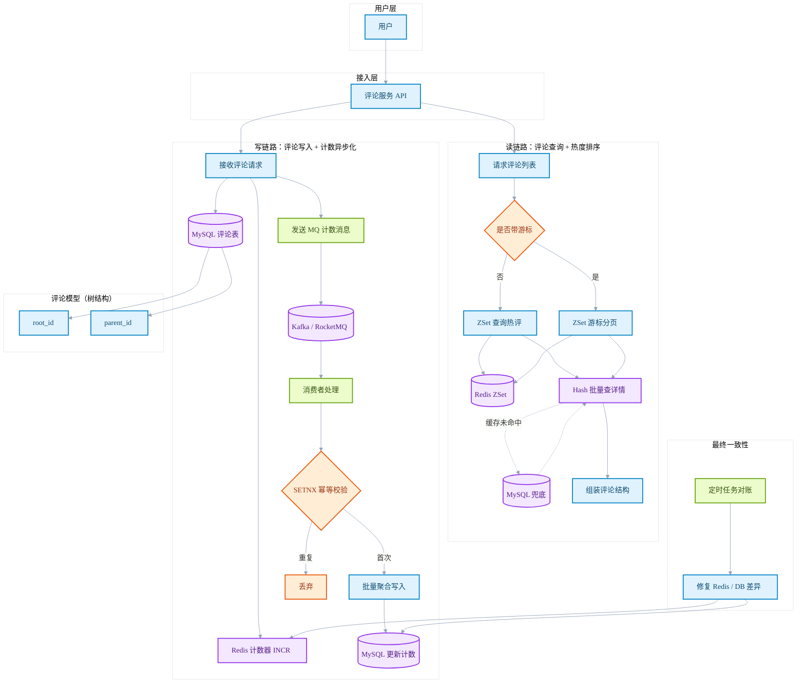
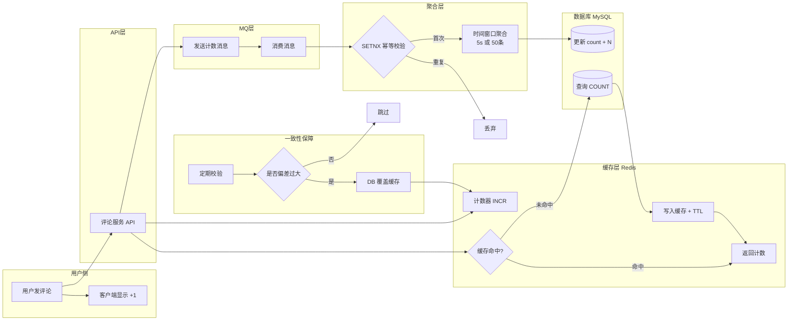

# 🎨 Border x Phycat: 极客级视觉进化

这是基于 **Border** 主题深度定制的进阶版本，融合了 **Phycat** 主题标志性的交互动态美学。它既保留了 Border 现代极简的框架骨架，又注入了 Phycat 灵动的灵魂，旨在打造一个不仅“好看”，而且具有“触力感”的数字笔记空间。

---

## 🚀 核心视觉特性提取

- **✨ 灵动文字系统**：
  - **加粗 (Bold)**：继承 Phycat 赛博光感，悬停时激活底部流光与边缘投影。
  - **斜体 (Italic)**：波浪形底纹设计，悬停时触发“缝合线”流光动画及阴影发光。
- **🧼 纯净表格质感**：
  - 彻底移除了底层噪点与波点干扰，采用**高级磨砂玻璃（Frosted Glass）表头，支持背景模糊透射。**
- **🫧 悬浮行内代码**：
  - 彻底重构的“气泡代码块”，悬停时具备**向上轻微浮动 (Lift)** 的 Q 弹交互反馈与发光特效。
- **🔭 渐进式发光列表**：
  - 极简圆点设计，当鼠标经过列表项时，圆点会自动**放大 1.6 倍**并散发对应的环境光。
- **🎭 Phycat 原生标题系统**：
  - **H1 居中艺术**：自带动态伸缩的下划线。
  - **H2 双子塔**：左侧双垂直线修饰，优雅而克制。
  - **H3-H6 几何魔力**：每级标题拥有专属的几何符号前缀与右侧 SVG 装饰图标。

---

## 1. 文本强化效果（原生 Phycat 继承版）

这是一段普通的文本，当我们使用 **粗体文本** 时，默认呈现出沉稳的祖母绿/赛博青色（深色模式下有发光边框，将鼠标悬停在上方看看边框的变化！）。

如果是 *斜体文本* 的话，文字下方会自带波浪线的流动效果，同样**悬停鼠标**能够激活缝合线的流光动画和阴影边缘发光效果。

当然，如果它们结合在一起变成 ***既粗又斜的重点文本***，也会获得非常抓人眼球的视觉呈现！

---

## 2. 行内代码块（气泡特效）
```java
1111111
1111111
1111111
1111111

```

除了传统的代码显示格式外，在普通文本中插入一些 `System.out.println("Hello Obsidian");` 这样的代码块时，不仅会有极简的边框包裹，只要你把鼠标放上去，还会立刻变色并出现浮空的发光气泡特效。

你可以看到 `const effect = "Phycat"` 或者 `pip install aesthetics` 这类行内代码能完美融入段落。

`你好`

```java

```
---

## 3. 玻璃质感表格（极致磨砂）

这部分是我们刚才深度美化的表格组件，去掉了 Obsidian 原版的生硬线条，换上了玻璃拟物态的透明虚化表格头。鼠标滑过每一行时还有高亮捕捉：

| 功能模块     | 原版状态        | 终极版表现 (Border V9)    |
| :------- | :---------- | :------------------- |
| **加粗系统** | 默认沉闷颜色，无交互  | 动态发光，Phycat 原生同等色彩映射 |
| *斜体特效*   | 仅改变字体倾斜角度   | 波浪底纹 + 鼠标悬停流动缝合线特效   |
| `代码泡泡`   | 呆板方框，偶有光标截断 | 悬浮气泡，无缝点击交互          |
| 磨砂表格     | 拥挤堆叠，文字死板   | 加宽边距，玻璃质感边界，表头高亮     |

---

# 1. 这里是 H1 居中标题
## 2. 这里是 H2 双子塔标题
### 3. 这里是 H3 垂直棒标题
#### 4. 这里是 H4 实心圆标题


11111111111111111111111111111111111111111111111111111111


```java

```
##### 5. 这里是 H5 空心圆标题


```java


```

## 5. 列表与缩进
这是一些无序列表的层级展示：
- 这是一个第一级项目（实心圆点）
  - 这是第二级项目（空心圆点）
    - 这是第三级项目（缩小版实心方块）
  - 第二级的另一个项目
- 第一级的另一个项目


![[Pasted image 20260330221101.png|799]]




